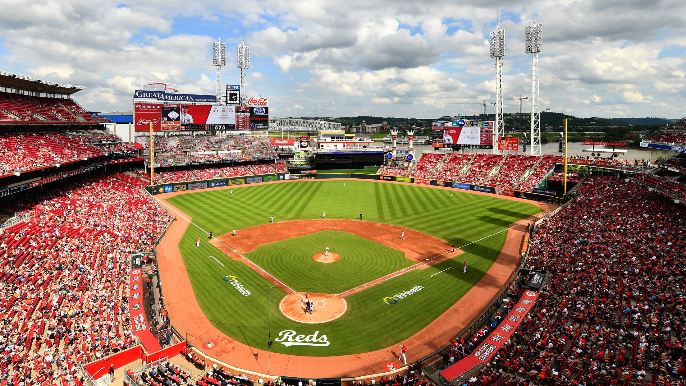

 
</head>

<body>
    <header>
        <h1>Cincinnati Reds</h1>
        <nav>
            <ul>
                <li><a href="index.html">Home</a></li>
                <li><a href="about.html">About the Team</a></li>
                <li><a href="contact.html">Fan Info</a></li>
            </ul>
        </nav>
    </header>

   
  <h2>Welcome to the Cincinnati Reds</h2>
            

                This website is a class project designed to showcase the basic structure
                of a website using semantic HTML. The topic is the Cincinnati Reds, a
                professional Major League Baseball team based in Cincinnati, Ohio.
            

        </section>
        <section id="team-overview">
            <h2>Team Overview</h2>
            

                This section will eventually provide an overview of the Reds, including
                their current roster, recent performance, and key players to watch.
            

  
        </section>

  <section>
            <h2>Purpose of This Site</h2>
            

                The purpose of this site is to practice organizing content using proper
                HTML structure, navigation, and semantic elements without applying any
                styling or design.
            

            

                <a href="#team-overview">Jump to Team Overview</a>
            

        </section>
    </main>

    
</body>
</html>
